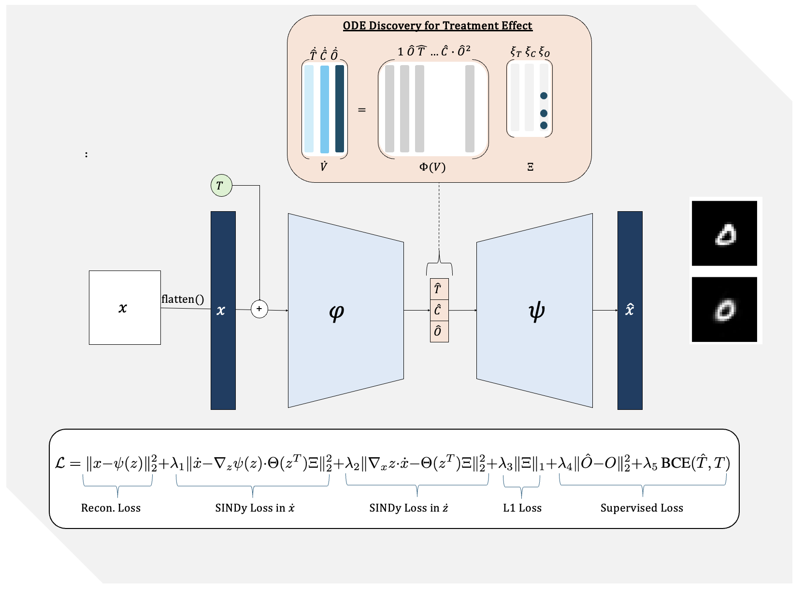

# Extension: ODE Discovery for Longitudinal Heterogeneous Treatment Effects Inference

This repository contains the implementation of our proposed framework for interpretable treatment effect estimation and counterfactual generation. The approach integrates Neural Causal Models (NCMs) with Sparse Identification of Nonlinear Dynamics (SINDy) for ODE discovery in a causally-constrained latent space, enabling the analysis of high-dimensional longitudinal data.

## Diagram of the Proposed


## Repository Structure
The repository is organized as follows:
```plaintext
├── autoencoder.py      # Benchmark autoencoder with SINDy for ODE discovery
├── vae.py              # Proposed VAE-NCM model with SINDy
├── dataset.py          # Synthetic dataset generation
├── train.py            # Training script for both models
├── metrics.py          # Evaluation metrics for model performance
├── dataset.ipynb       # Notebook for trajectory and dataset visualization
├── requirements.txt    # Python dependencies
├── README.md           # Project overview
```

## Features
1. **Synthetic Dataset**: 
   - The dataset is generated using `dataset.py` and visualized in `dataset.ipynb`.
   - High-dimensional image data represents longitudinal trajectories with ground-truth ODE-governed outcomes, including both true and counterfactual trajectories.


2. **Benchmark Model**: 
   - Implemented in `autoencoder.py`.
   - Combines a fully connected autoencoder with SINDy to discover ODEs in a latent space, applied to longitudinal treatment effect estimation.




3. **Proposed Method**:
   - Implemented in `vae.py`.
   - Introduces a convolutional Variational Autoencoder (VAE) integrated with a Neural Causal Model (NCM).
   - Applies SINDy within the causally-constrained latent space for interpretable ODE discovery.
   - Provides counterfactual image generation under hypothetical interventions.

4. **Training**:
   - The `train.py` script supports training for both the benchmark and proposed models.
   - Includes supervised and unsupervised loss terms, including reconstruction, causal alignment, and SINDy sparsity constraints.

5. **Metrics**:
   - `metrics.py` evaluates reconstruction quality, trajectory prediction accuracy, and alignment with true governing dynamics.

## Installation
1. Clone the repository:
   ```bash
   git clone https://github.com/your-repo/interpretable-treatment-effect.git
   cd interpretable-treatment-effect
## Dataset Generation
jupyter notebook dataset.ipynb

## Training
python train.py --dataset_dir --save_dir --device 
